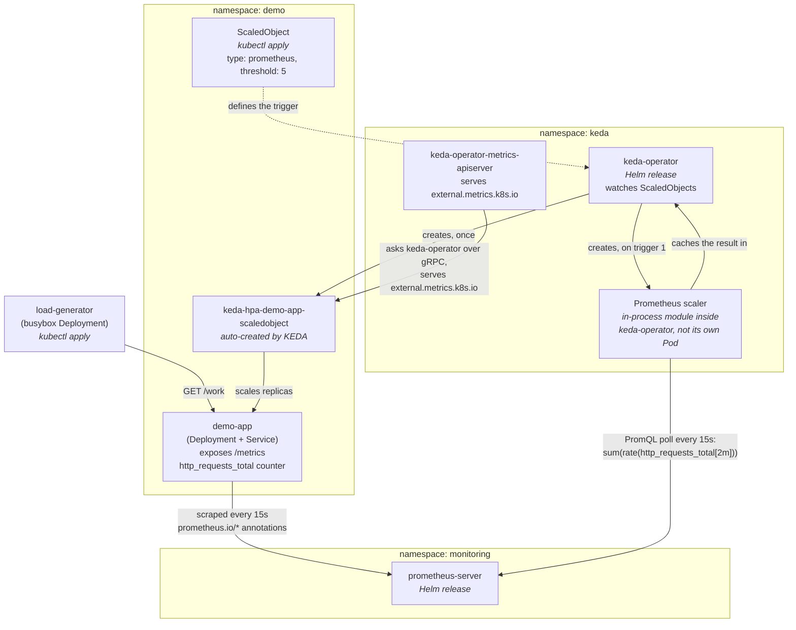

# Scaling Kubernetes Pods on Real Traffic with KEDA + Prometheus

This is a step-by-step guide to autoscaling a Kubernetes app on a real
traffic metric (**requests per second**) instead of CPU — using **KEDA**
this time, instead of the Prometheus Adapter + HPA combo. It's built for a
[Killercoda "Kubernetes Playground"](https://killercoda.com/playgrounds/scenario/kubernetes)
cluster, and it's the companion to the
[Prometheus Adapter version](../Prometheus-Adapter/Readme.md) of this same demo.

> ✅ **End result:** on a real Killercoda run, the ScaledObject took
> `demo-app` from 1 → 5 replicas in under a minute once traffic started,
> driven entirely by a Prometheus counter — then back down to 1 about a
> minute after the load stopped. Full transcript in
> [Proof: watch it actually scale](#proof-watch-it-actually-scale).

**Install split:**
- **Prometheus** → Helm (`prometheus-community/prometheus`)
- **KEDA** → Helm (`kedacore/keda`)
- **Everything else** (demo app, ScaledObject, load generator) → raw `kubectl apply -f`

## Contents

- [Architecture](#architecture)
- [KEDA Operator Architecture (chronological)](#keda-operator-architecture-chronological)
  - [Failure modes: what if a component dies?](#failure-modes-what-if-a-component-dies)
- [Files](#files)
- [Why KEDA instead of the Prometheus Adapter?](#why-keda-instead-of-the-prometheus-adapter)
- [Understanding the key configuration](#understanding-the-key-configuration)
- [0. Prerequisites (Killercoda)](#0-prerequisites-killercoda)
- [1. Namespaces + Helm repos](#1-namespaces--helm-repos)
- [2. Deploy the demo app](#2-deploy-the-demo-app-raw-kubectl-apply)
- [3. Install Prometheus via Helm](#3-install-prometheus-via-helm)
- [4. Install KEDA via Helm](#4-install-keda-via-helm)
- [5. Deploy the ScaledObject](#5-deploy-the-scaledobject-raw-kubectl-apply)
- [6. Trigger a scale-out with the load generator](#6-trigger-a-scale-out-with-the-load-generator-raw-kubectl-apply)
- [Proof: watch it actually scale](#proof-watch-it-actually-scale)
- [7. Cleanup](#7-cleanup)
- [Troubleshooting](#troubleshooting)
- [References](#references)

## Architecture




Same reason as the Adapter demo for using a *rate* instead of the raw
counter: `http_requests_total` only ever goes up, so if we scaled on that
number directly, it would scale up forever and never come back down. The
PromQL in the ScaledObject turns it into a `rate(...)` — a number that
rises and falls with actual traffic, like it should.

The big difference from the Adapter version: there's no
`custom.metrics.k8s.io` API to register, no adapter rule file to write,
and no RBAC to wire up by hand (`auth-delegator`, `auth-reader`,
`custom-metrics-server-resources`). KEDA's operator just talks to
Prometheus directly, and its own metrics server exposes
`external.metrics.k8s.io` to the HPA for you. More on that below in
[Why KEDA instead of the Prometheus Adapter?](#why-keda-instead-of-the-prometheus-adapter)

## KEDA Operator Architecture (chronological)

KEDA isn't a single process. Installing it actually gives you **three**
separate components plus a handful of CRDs — and on top of that, plain old
Kubernetes (the HPA controller inside `kube-controller-manager`, completely
untouched) still does the real scaling work. Here's who does what:

| Component | Runs as | Job |
|---|---|---|
| `keda-operator` | Deployment, `keda` ns | Watches your `ScaledObject`/`ScaledJob` resources, works out what needs scaling, runs the actual scalers (Prometheus, Kafka, etc.), and creates/owns the HPA for each ScaledObject. It also scales 0 ↔ 1 pods itself, since a normal HPA can't do anything when there are zero pods running. |
| ↳ **Prometheus scaler** | *A module living inside `keda-operator`* — **not** its own Pod | The part that actually speaks PromQL. One of these gets created per `type: prometheus` trigger, holding the `serverAddress`/`query`/`threshold` you configured. It's the **only** thing in this whole chain that ever talks to Prometheus. |
| `keda-operator-metrics-apiserver` | Deployment, `keda` ns | Exposes the `external.metrics.k8s.io` API that Kubernetes expects. It doesn't calculate anything itself — it just asks `keda-operator` for the number over an internal **gRPC** call (port `9666`) and passes back whatever it gets. |
| `keda-admission-webhooks` | Deployment, `keda` ns | Checks your `ScaledObject`/`ScaledJob` for obvious mistakes the moment you `kubectl apply` it (like `scaleTargetRef` missing, or `minReplicaCount` bigger than `maxReplicaCount`) — so you get an error right away instead of a config that silently never scales. |
| `ScaledObject` / `ScaledJob` CRDs | Custom Resource | The file you write (`manifests/30-scaledobject.yaml`). It says what to scale, the min/max replicas, and what should trigger scaling — here, a Prometheus query. |
| `TriggerAuthentication` / `ClusterTriggerAuthentication` CRDs | Custom Resource | Where you'd put credentials for a trigger that needs auth — API keys, DB passwords, etc. Not used here, since our Prometheus has no auth on it. |
| HPA controller | Inside `kube-controller-manager`, untouched | The thing that actually changes the replica count. KEDA doesn't replace it — it just feeds it a number through the external metrics API, the same way the Adapter demo fed it through the custom metrics API. |

> **The one thing worth remembering:** the **Prometheus scaler** (inside
> `keda-operator`) talks to *Prometheus*. The **HPA** talks to
> *Kubernetes' external metrics API*. `keda-operator-metrics-apiserver`
> just sits in between the two — and all three of those links can break
> on their own, independently of each other (see
> [Failure modes](#failure-modes-what-if-a-component-dies) below).

**What happens, in order** (steps ⑤–⑩ keep repeating on their own
schedules once the ScaledObject is up and running):


1. **You apply the ScaledObject** — `kubectl apply -f manifests/30-scaledobject.yaml`.
2. **`keda-admission-webhooks` checks it's valid** before Kubernetes even saves it.
3. **`keda-operator` picks it up** — works out that `demo-app` is what needs scaling, and creates a **Prometheus scaler** for this trigger using the `serverAddress`/`query`/`threshold` you gave it.
4. **`keda-operator` creates the HPA** for you — `keda-hpa-demo-app-scaledobject`, pointed at `demo-app`, wired to an External metric it owns.
5. **The Prometheus scaler runs the query** against Prometheus to keep the ScaledObject's status current. This is the only step where anything actually talks to Prometheus. (`pollingInterval` doesn't pace this in our setup — see the real-world catch below.)
6. **Separately, the normal HPA controller does its own ~15s check**, sees the ScaledObject points at an External metric, and calls `external.metrics.k8s.io` to ask for it.
7. **`keda-operator-metrics-apiserver` answers that call** — it asks `keda-operator` for the cached value over gRPC, and hands it back.
8. **The HPA does the maths** — `desiredReplicas = ceil(totalValue / threshold)`, capped between `minReplicaCount` and `maxReplicaCount` — then updates `demo-app`'s replica count.
9. **Kubernetes creates or removes pods to match** — totally normal Kubernetes behaviour, nothing KEDA-specific about this step.
10. **The loop closes back through Prometheus** — the new set of pods changes what Prometheus scrapes, so the next PromQL check (back at step ⑤) reflects the new spread of load.

**The condensed version, if you just want the short list:**

| Step | Who | Talks to | What happens |
|---|---|---|---|
| 1 | Prometheus | `demo-app` | Scrapes `/metrics` every 15s |
| 2 | Prometheus scaler (in `keda-operator`) | Prometheus | Runs the PromQL query |
| 3 | `keda-operator` | `keda-operator-metrics-apiserver` | Hands over the cached value, over gRPC |
| 4 | HPA controller | `external.metrics.k8s.io` | Asks for the metric — has no idea Prometheus or PromQL even exist |
| 5 | HPA controller | `demo-app` Deployment | Changes `spec.replicas` |

**Real-world catch, found by actually running this:** apply
`manifests/30-scaledobject.yaml` yourself and KEDA's own admission webhook
warns you, right there in the terminal:

```
Warning: PollingInterval is configured but is not relevant. PollingInterval is only relevant when minReplicaCount = 0 or idleReplicaCount = 0 or useCachedMetrics is enabled
Warning: CooldownPeriod is configured but is not relevant. CooldownPeriod is only relevant when minReplicaCount = 0 or idleReplicaCount = 0
```

Since this demo keeps `minReplicaCount: 1`, both `pollingInterval` and
`cooldownPeriod` are dead weight — they only matter for the 0↔1
scale-to-zero path described just below, not for the `1 → N` scaling this
demo actually does. They're harmless to leave in the YAML (handy once you
try scale-to-zero yourself), just don't expect them to change anything
while `minReplicaCount` stays at `1`.

**Scale-to-zero, for context (not used in this demo, since we keep
`minReplicaCount: 1`):** if the trigger stays quiet for `cooldownPeriod`,
`keda-operator` scales `demo-app` down to `0` itself — skipping the HPA
entirely, because an HPA can't do anything with zero pods (there'd be no
metrics to read). The moment traffic comes back, `keda-operator` bumps it
back up to `1`, then hands control back to the HPA for everything above
that. This is something the Adapter+HPA setup simply can't do — see the
[comparison table](#why-keda-instead-of-the-prometheus-adapter) below.

### Failure modes: what if a component dies?

There are three separate links in this chain, so Prometheus being healthy
doesn't mean scaling is working — and scaling working doesn't mean
Prometheus is healthy either. It's worth walking through what breaks when
each piece goes down:

**If `keda-operator-metrics-apiserver` crashes:**
```
Prometheus                        ✅  demo-app still gets scraped fine
Prometheus scaler                 ✅  keda-operator can still reach Prometheus
keda-operator-metrics-apiserver   ❌  external.metrics.k8s.io has no backend
HPA controller                    ✅  but its call for the External metric fails
```
So even though Prometheus and the scaler are both working fine, the HPA
has no way to get the number anymore. You'll see `kubectl describe hpa -n
demo` throw events like `unable to fetch metrics from external metrics
API`, and `kubectl get apiservice v1beta1.external.metrics.k8s.io` will
show `AVAILABLE: False`. To fix it: check `kubectl rollout status
deployment/keda-operator-metrics-apiserver -n keda` and look at its logs.

**If Prometheus goes down instead:**
```
Prometheus                        ❌  nothing to scrape from
Prometheus scaler                 ❌  its PromQL call to serverAddress fails
keda-operator-metrics-apiserver   ✅  still up, just has nothing fresh to serve
HPA controller                    ✅  still calling the API on schedule
```
`kubectl describe scaledobject demo-app-scaledobject -n demo` will show
`ScalingActive`/`Ready` flip to `False`, and `kubectl logs -n keda deploy/
keda-operator` will show the Prometheus scaler failing to connect
(connection refused / timeout). The HPA is still running fine — it just
can't get a fresh number. KEDA holds onto the last known value for a
little while, then marks the ScaledObject unhealthy.

The short version: the **scaler → Prometheus** link and the
**metrics-apiserver → HPA** link are two separate things that can break on
their own. If scaling stops working, the first question is always: which
one broke? `kubectl describe scaledobject` tells you about the first link,
`kubectl describe hpa` tells you about the second.

## Files

```
docs/
  keda-architecture.svg   chronological KEDA + Prometheus architecture diagram (see above)
helm/
  prometheus-values.yaml  Helm values for the Prometheus chart (adds the demo-app scrape job)
  keda-values.yaml        Helm values for the KEDA chart (trims resource requests/limits)
manifests/
  00-namespaces.yaml        demo + monitoring namespaces (keda namespace comes from --create-namespace)
  01-demo-app-configmap.yaml dummy app source (stdlib-only Python, no image build needed)
  02-demo-app-deployment.yaml Deployment + Service for the demo app
  30-scaledobject.yaml       ScaledObject targeting http_requests_total via a Prometheus trigger
  31-load-generator.yaml     busybox pod hammering demo-app to trigger a scale-out
```

No Dockerfile, no image registry needed — the "app" is the same small
Python script (stdlib only) from the Adapter demo, loaded in through a
`ConfigMap` and run using the public `python:3.12-alpine` image.

## Why KEDA instead of the Prometheus Adapter?

| | Prometheus Adapter + HPA | KEDA |
|---|---|---|
| Metric path | Prometheus → Adapter → `custom.metrics.k8s.io` → HPA | Prometheus → KEDA operator → HPA it creates for you |
| RBAC/API wiring | Manual: `APIService`, `auth-delegator`, `auth-reader`, `custom-metrics-server-resources` ClusterRoleBinding | Chart-managed; nothing to hand-wire |
| Config object | Adapter's `rules.custom` block (Helm values, cluster-wide) | `ScaledObject` CRD (per-workload, namespaced) |
| Scale to zero | Not possible — HPA has a hard `minReplicas: 1` floor | Supported (`minReplicaCount: 0` + `idleReplicaCount`) — not used in this demo to keep it directly comparable |
| Other event sources | Prometheus only | 60+ scalers (Kafka, SQS, RabbitMQ, cron, Redis, ...) behind the same CRD |
| Rule scope | One rule config governs every metric of that shape, cluster-wide | One ScaledObject per workload — easier to reason about, easier to blast-radius-limit |

Under the hood, both approaches still run on a normal Kubernetes
`HorizontalPodAutoscaler` — KEDA just creates and manages that HPA for you
(named `keda-hpa-<scaledobject-name>`) instead of you writing one by hand.

---

## Understanding the key configuration

Four things really matter here — three of them (app metrics, scrape
relabeling, HPA scaling maths) are exactly the same as the Adapter demo.

### 1. The app hand-writes its own metrics — no client library

```
# TYPE http_requests_total counter
http_requests_total{method="GET",path="/work"} 2
```

Same as before: plain text output, and `# TYPE counter` tells Prometheus
this number only ever goes up — which is exactly what `rate()` needs.

### 2. Scrape relabeling — the #1 silent-failure point

```yaml
kubernetes_sd_configs:
- role: pod
relabel_configs:
- source_labels: [__meta_kubernetes_pod_annotation_prometheus_io_scrape]
  action: keep
  regex: true
```

| Rule | Why |
|---|---|
| `role: pod` | Discovers **every** pod in the cluster as a candidate |
| `keep` on the annotation | Narrows it to pods with `prometheus.io/scrape: "true"` |
| rebuild `__address__` / `__metrics_path__` | Reads the actual port/path from `prometheus.io/port` and `/path` |
| `labelmap` | Copies pod labels onto the stored series |
| promote `namespace` / `pod` | Turns `__meta_kubernetes_namespace/pod_name` into plain labels the ScaledObject's PromQL can filter on |

### 3. The ScaledObject — one CRD, no separate rule config

```yaml
spec:
  scaleTargetRef:
    name: demo-app
  minReplicaCount: 1
  maxReplicaCount: 5
  pollingInterval: 15
  cooldownPeriod: 60
  triggers:
  - type: prometheus
    metadata:
      serverAddress: http://prometheus-server.monitoring.svc.cluster.local
      query: sum(rate(http_requests_total{namespace="demo"}[2m]))
      threshold: "5"
```

| Field | Job |
|---|---|
| `scaleTargetRef` | Which Deployment KEDA should scale — same idea as the HPA's `scaleTargetRef` |
| `pollingInterval` | How often, in seconds, KEDA checks the trigger — but only for the 0↔1 scale-to-zero path. At `minReplicaCount: 1` like here, KEDA's own admission webhook warns you it's a no-op (real warning in step 5 below). |
| `cooldownPeriod` | How long to wait after the trigger goes quiet before scaling to `minReplicaCount` — again, only relevant when scaling to/from zero. Same "not relevant" warning applies at `minReplicaCount: 1`. Left in the YAML for when you experiment with scale-to-zero yourself. |
| `query` | The PromQL itself. No need for `by (pod)` like the Adapter version — KEDA's default `metricType` (`AverageValue`) automatically divides the total by however many replicas are running. |
| `threshold` | Same job as `averageValue: "5"` in the Adapter demo — the requests/sec we want per replica. |

### 4. No aggregated API RBAC to hand-wire

The Adapter demo needed you to wire up three separate RBAC bits by hand
(TLS trust, `auth-delegator`/`auth-reader`, and a ClusterRoleBinding)
because the Adapter itself *is* the `custom.metrics.k8s.io` API server.
KEDA's Helm chart sets all of that up for its own `external.metrics.k8s.io`
API — there's nothing left for you to configure. We check this is working
in step 4 below.

### 5. HPA scaling math (via the HPA KEDA creates)

Same maths as the Adapter demo, since KEDA's default `AverageValue`
metric type behaves exactly like normal Kubernetes HPA maths:

```
desiredReplicas = ceil(currentAverageValue / threshold)
```

So if 3 pods together are handling 30 req/s, that's `ceil(30 / 5)` = `6`
desired replicas, capped at our `maxReplicaCount: 5`. The
`stabilizationWindowSeconds: 60` setting stops it flapping up and down,
same as it did in the plain HPA version.

### 6. Load generator: concurrency, not rate, drives throughput

Same as the Adapter demo — 10 loops each firing one request at a time, so
the real rate is roughly `10 ÷ average latency`, not a flat "10 req/s".
More parallel loops means more throughput.

---

## 0. Prerequisites (Killercoda)

1. Start the **Kubernetes Playground** scenario on Killercoda (or any
   scenario that gives you a working multi-node cluster with `kubectl`
   pre-configured).
2. Confirm the cluster is up and Helm is available:
   ```bash
   kubectl get nodes
   helm version
   ```
   If `helm` isn't installed:
   ```bash
   curl -fsSL -o get_helm.sh https://raw.githubusercontent.com/helm/helm/main/scripts/get-helm-3
   chmod +x get_helm.sh
   ./get_helm.sh
   ```
3. Get this repo's `helm/` and `manifests/` directories onto the playground
   terminal (clone it if you've pushed it to GitHub, or copy the files over
   another way).

> **Heads up:** just like the Adapter demo, `kubectl top nodes` won't work
> on this cluster (`error: Metrics API not available`) — that needs a
> separate `metrics-server` component we're not installing here. Everything
> in this guide goes through `external.metrics.k8s.io` instead, served by
> KEDA's own metrics server (installed in step 4), a completely different API.

Everything below assumes your shell's current directory is this repo's
root (the one containing `helm/`, `manifests/`, `Readme.md`).

---

## 1. Namespaces + Helm repos

```bash
kubectl apply -f manifests/00-namespaces.yaml

helm repo add prometheus-community https://prometheus-community.github.io/helm-charts
helm repo add kedacore https://kedacore.github.io/charts
helm repo update
```

Real output:
```
namespace/demo created
namespace/monitoring created
"prometheus-community" has been added to your repositories
"kedacore" has been added to your repositories
Hang tight while we grab the latest from your chart repositories...
...Successfully got an update from the "kedacore" chart repository
...Successfully got an update from the "prometheus-community" chart repository
Update Complete. ⎈Happy Helming!⎈
```

The `keda` namespace isn't created here — `helm install --create-namespace`
in step 4 creates it for you.

---

## 2. Deploy the demo app (raw `kubectl apply`)

```bash
kubectl apply -f manifests/01-demo-app-configmap.yaml
kubectl apply -f manifests/02-demo-app-deployment.yaml
kubectl rollout status deployment/demo-app -n demo
```

Real output:
```
configmap/demo-app-code created
deployment.apps/demo-app created
service/demo-app-svc created
Waiting for deployment spec update to be observed...
Waiting for deployment "demo-app" rollout to finish: 0 out of 1 new replicas have been updated...
Waiting for deployment "demo-app" rollout to finish: 0 of 1 updated replicas are available...
deployment "demo-app" successfully rolled out
```

**Verify the metric exists and increments** (identical to the Adapter demo):

```bash
kubectl run curl-test --rm -it --restart=Never --image=curlimages/curl -n demo \
  -- sh -c 'for i in $(seq 1 5); do curl -s http://demo-app-svc.demo.svc.cluster.local:8080/work; done; curl -s http://demo-app-svc.demo.svc.cluster.local:8080/metrics'
```

Real output:
```
work done
work done
work done
work done
work done
# HELP http_requests_total Total number of HTTP requests handled by /work
# TYPE http_requests_total counter
http_requests_total{method="GET",path="/work"} 5
```

---

## 3. Install Prometheus via Helm

```bash
helm install prometheus prometheus-community/prometheus \
  -n monitoring \
  -f helm/prometheus-values.yaml

kubectl rollout status deployment/prometheus-server -n monitoring --timeout=180s
```

Real output (trimmed):
```
NAME: prometheus
LAST DEPLOYED: Mon Aug 24 19:50:39 2026
NAMESPACE: monitoring
STATUS: deployed
REVISION: 1
DESCRIPTION: Install complete
TEST SUITE: None
NOTES:
The Prometheus server can be accessed via port 80 on the following DNS name from within your cluster:
prometheus-server.monitoring.svc.cluster.local

#################################################################################
######   WARNING: Persistence is disabled!!! You will lose your data when   #####
######            the Server pod is terminated.                             #####
#################################################################################

Waiting for deployment spec update to be observed...
Waiting for deployment "prometheus-server" rollout to finish: 0 out of 1 new replicas have been updated...
Waiting for deployment "prometheus-server" rollout to finish: 0 of 1 updated replicas are available...
deployment "prometheus-server" successfully rolled out
```

That persistence warning is expected — it's exactly what
`helm/prometheus-values.yaml` disables on purpose (see [Files](#files)).

**Confirm the Service name/port** (the ScaledObject needs this to be right):

```bash
kubectl get svc -n monitoring
```

Real output:
```
NAME                TYPE        CLUSTER-IP       EXTERNAL-IP   PORT(S)   AGE
prometheus-server   ClusterIP   10.102.245.194   <none>        80/TCP    104s
```

`prometheus-server` on port `80` — matches `serverAddress` in
`manifests/30-scaledobject.yaml`. If your resolved chart version names it
differently, update that field before step 5.

**Verify Prometheus is scraping the app** — same as the Adapter demo:

```bash
kubectl port-forward --address 0.0.0.0 -n monitoring svc/prometheus-server 9090:80
```

Real output:
```
Forwarding from 0.0.0.0:9090 -> 9090
Handling connection for 9090
```

Open the Killercoda-exposed port `9090`, go to **Status → Targets**, and
confirm a `custom-pod-metrics` job with `demo-app`'s pod `UP`. Stop the
port-forward (`Ctrl+C`) once confirmed.

---

## 4. Install KEDA via Helm

```bash
helm install keda kedacore/keda \
  -n keda --create-namespace \
  -f helm/keda-values.yaml

kubectl rollout status deployment/keda-operator -n keda --timeout=180s
kubectl rollout status deployment/keda-operator-metrics-apiserver -n keda --timeout=180s
```

Real output (the ASCII KEDA logo is trimmed, everything else is verbatim):
```
NAME: keda
LAST DEPLOYED: Mon Aug 24 19:54:59 2026
NAMESPACE: keda
STATUS: deployed
REVISION: 1
DESCRIPTION: Install complete
TEST SUITE: None
NOTES:
Kubernetes Event-driven Autoscaling (KEDA) - Application autoscaling made simple.

Get started by deploying Scaled Objects to your cluster:
    - Information about Scaled Objects : https://keda.sh/docs/latest/concepts/
    - Samples: https://github.com/kedacore/samples
...
Waiting for deployment "keda-operator" rollout to finish: 0 of 1 updated replicas are available...
deployment "keda-operator" successfully rolled out
Waiting for deployment "keda-operator-metrics-apiserver" rollout to finish: 0 of 1 updated replicas are available...
deployment "keda-operator-metrics-apiserver" successfully rolled out
```

**Verify the CRDs and pods:**

```bash
kubectl get crd | grep keda.sh
kubectl get pods -n keda
```

Real output:
```
cloudeventsources.eventing.keda.sh
clustercloudeventsources.eventing.keda.sh
clustertriggerauthentications.keda.sh
scaledjobs.keda.sh
scaledobjects.keda.sh
triggerauthentications.keda.sh

NAME                                               READY   STATUS    RESTARTS      AGE
keda-admission-webhooks-584f498646-kddhv           1/1     Running   0             82s
keda-operator-65968474b9-8lkk7                     1/1     Running   1 (63s ago)   82s
keda-operator-metrics-apiserver-9fbb84644-sh5h9    1/1     Running   0             82s
```

Don't be alarmed by `RESTARTS: 1` on `keda-operator` — it restarted once
about a minute in on this run and then stayed stable. That's normal on a
fresh install (it's usually the operator coming up before its webhook
certs have fully propagated) and isn't something to chase.

**Verify the external metrics APIService is healthy** — this is the KEDA
equivalent of the Adapter demo's `v1beta1.custom.metrics.k8s.io` check:

```bash
kubectl get apiservice v1beta1.external.metrics.k8s.io
```

Real output:
```
NAME                               SERVICE                                 AVAILABLE   AGE
v1beta1.external.metrics.k8s.io    keda/keda-operator-metrics-apiserver   True        102s
```

`AVAILABLE: True` — there's no separate cert/RBAC step to check here, the
chart already took care of it (see
[Understanding the key configuration, §4](#4-no-aggregated-api-rbac-to-hand-wire)).

---

## 5. Deploy the ScaledObject (raw `kubectl apply`)

```bash
kubectl apply -f manifests/30-scaledobject.yaml
kubectl get scaledobject -n demo
```

Real output:
```
Warning: PollingInterval is configured but is not relevant. PollingInterval is only relevant when minReplicaCount = 0 or idleReplicaCount = 0 or useCachedMetrics is enabled
Warning: CooldownPeriod is configured but is not relevant. CooldownPeriod is only relevant when minReplicaCount = 0 or idleReplicaCount = 0
scaledobject.keda.sh/demo-app-scaledobject created
NAME                     SCALETARGETKIND      SCALETARGETNAME   MIN   MAX   READY   ACTIVE   FALLBACK   PAUSED   TRIGGERS     AUTHENTICATIONS   AGE
demo-app-scaledobject    apps/v1.Deployment    demo-app          1     5     True    False    False      False    prometheus                     19s
```

Those two `Warning:` lines are the real-world catch mentioned earlier —
harmless here, just KEDA telling you `pollingInterval`/`cooldownPeriod`
don't do anything at `minReplicaCount: 1`. Right after applying, you'll
likely catch it still mid-startup (`READY: Unknown`, `TRIGGERS` blank) for
a second or two before it settles into the row above.

`READY: True` means KEDA accepted the config and set up the trigger.
`ACTIVE: False` just means there's no load yet.

**Confirm KEDA created the underlying HPA:**

```bash
kubectl get hpa -n demo
```

Real output:
```
NAME                             REFERENCE             TARGETS     MINPODS   MAXPODS   REPLICAS   AGE
keda-hpa-demo-app-scaledobject   Deployment/demo-app   0/5 (avg)   1         5         1          31s
```

Then:

```bash
kubectl describe scaledobject demo-app-scaledobject -n demo
```

Real output (trimmed to the useful parts):
```
Status:
  Conditions:
    Message:  ScaledObject is defined correctly and is ready for scaling
    Reason:   ScaledObjectReady
    Status:   True
    Type:     Ready
    Message:  Scaling is not performed because triggers are not active
    Reason:   ScalerNotActive
    Status:   False
    Type:     Active
  External Metric Names:
    s0-prometheus
  Hpa Name:  keda-hpa-demo-app-scaledobject
  Triggers Activity:
    s0-prometheus:
      Is Active:   false
Events:
  Type    Reason              Age    From            Message
  ----    ------              ----   ----            -------
  Normal  KEDAScalersStarted  94s    keda-operator   Scaler prometheus is built
  Normal  KEDAScalersStarted  94s    keda-operator   Started scalers watch
  Normal  ScaledObjectReady   94s    keda-operator   ScaledObject is ready for scaling
```

`Type: Ready / Status: True` means KEDA accepted the config and set up the
Prometheus scaler. `Type: Active / Status: False` just means there's no
load yet — once the load generator starts in step 6, that condition flips
to `Reason: ScalerActive`, `Message: Scaling is performed because triggers
are active`.

If `Ready` stays `False`/`Unknown` for more than ~2 minutes, see
[Troubleshooting](#troubleshooting).

---

## 6. Trigger a scale-out with the load generator (raw `kubectl apply`)

In one terminal, watch the HPA KEDA created:

```bash
kubectl get hpa -n demo -w
```

In another terminal, watch the pods:

```bash
kubectl get pods -n demo -w
```

In a third terminal, start the load generator (10 parallel tight loops
hitting `/work`, comfortably over the `5 req/s per pod` threshold):

```bash
kubectl apply -f manifests/31-load-generator.yaml
```

**Trigger scale-down:** delete the load generator and wait — the
`stabilizationWindowSeconds: 60` in the ScaledObject's
`advanced.horizontalPodAutoscalerConfig.behavior.scaleDown` means the HPA
waits ~60s of low load before scaling back down:

```bash
kubectl delete -f manifests/31-load-generator.yaml
kubectl get hpa -n demo -w
```

---

## Proof: watch it actually scale

This is the real `-w` transcript from a run on Killercoda — unedited,
straight from the terminal.

**HPA current value climbing, replicas following:**

```
NAME                             REFERENCE             TARGETS          MINPODS   MAXPODS   REPLICAS   AGE
keda-hpa-demo-app-scaledobject   Deployment/demo-app   0/5 (avg)        1         5         1          3m23s
keda-hpa-demo-app-scaledobject   Deployment/demo-app   18591m/5 (avg)   1         5         1          4m30s
keda-hpa-demo-app-scaledobject   Deployment/demo-app   12955m/5 (avg)   1         5         4          4m45s
keda-hpa-demo-app-scaledobject   Deployment/demo-app   12507m/5 (avg)   1         5         5          5m
```

Read as req/s: **0 → 18.6 → 13.0 → 12.5**, comfortably past the target of
`5` per pod. KEDA's default scale-up policy let it jump straight from 1 to
4 replicas in one step, then to the `maxReplicaCount: 5` ceiling 15
seconds later.

**Pods scaling out in response** (`kubectl get pods -n demo -w`, trimmed to
the interesting bit):

```
NAME                              READY   STATUS              RESTARTS   AGE
demo-app-78d6fb6b76-r7k48         1/1     Running             0          11m   <- original pod
load-generator-7c7d858784-6jkkn   1/1     Running             0          2s
demo-app-78d6fb6b76-rpc6s         0/1     Pending             0          0s
demo-app-78d6fb6b76-6rbwx         0/1     Pending             0          0s
demo-app-78d6fb6b76-2cxk4         0/1     Pending             0          0s
demo-app-78d6fb6b76-6rbwx         1/1     Running             0          6s
demo-app-78d6fb6b76-rpc6s         1/1     Running             0          11s
demo-app-78d6fb6b76-2cxk4         1/1     Running             0          12s
demo-app-78d6fb6b76-pghbh         0/1     Pending             0          0s
demo-app-78d6fb6b76-pghbh         1/1     Running             0          6s
```

**1 → 5 replicas, exactly at `maxReplicaCount`.** ✅

**The full round trip — same watch, load generator deleted partway through:**

```
NAME                             REFERENCE             TARGETS          REPLICAS   AGE
keda-hpa-demo-app-scaledobject   Deployment/demo-app   0/5 (avg)        1          3m23s
keda-hpa-demo-app-scaledobject   Deployment/demo-app   18591m/5 (avg)   1          4m30s
keda-hpa-demo-app-scaledobject   Deployment/demo-app   12955m/5 (avg)   4          4m45s
keda-hpa-demo-app-scaledobject   Deployment/demo-app   12507m/5 (avg)   5          5m
keda-hpa-demo-app-scaledobject   Deployment/demo-app   14649m/5 (avg)   5          5m15s
keda-hpa-demo-app-scaledobject   Deployment/demo-app   17104m/5 (avg)   5          5m30s
keda-hpa-demo-app-scaledobject   Deployment/demo-app   16080m/5 (avg)   5          5m45s
keda-hpa-demo-app-scaledobject   Deployment/demo-app   22936m/5 (avg)   5          6m
keda-hpa-demo-app-scaledobject   Deployment/demo-app   28119m/5 (avg)   5          6m15s
keda-hpa-demo-app-scaledobject   Deployment/demo-app   33798m/5 (avg)   5          6m30s
keda-hpa-demo-app-scaledobject   Deployment/demo-app   33857m/5 (avg)   5          6m45s   ← peak load, generator still running
keda-hpa-demo-app-scaledobject   Deployment/demo-app   30120m/5 (avg)   5          7m
keda-hpa-demo-app-scaledobject   Deployment/demo-app   26230m/5 (avg)   5          7m15s   ← load generator deleted around here
keda-hpa-demo-app-scaledobject   Deployment/demo-app   14420m/5 (avg)   5          7m30s
keda-hpa-demo-app-scaledobject   Deployment/demo-app   5794m/5 (avg)    5          7m45s
keda-hpa-demo-app-scaledobject   Deployment/demo-app   637m/5 (avg)     5          8m
keda-hpa-demo-app-scaledobject   Deployment/demo-app   0/5 (avg)        5          8m16s   ← rate finally decays to 0
keda-hpa-demo-app-scaledobject   Deployment/demo-app   0/5 (avg)        5          8m46s   ← still 5: stabilization window holding
keda-hpa-demo-app-scaledobject   Deployment/demo-app   0/5 (avg)        1          9m1s    ← scaled back to minReplicaCount
```

**1 → 5 → 1, fully closed loop.** Two things called out earlier are
visible directly in these numbers:

- The value doesn't drop to `0` the instant the load generator is deleted
  — it *decays* over roughly two minutes (`33857m` → `26230m` → ... →
  `637m` → `0`). That's `rate(...[2m])` in the ScaledObject's query: it's
  a rolling 2-minute window, so old traffic keeps contributing to the
  number until it ages out.
- Replicas stay at `5` for a while *after* the metric already reads `0`
  (`8m16s` → `9m1s`, ~45s). That's
  `stabilizationWindowSeconds: 60` — the HPA remembers the highest recent
  recommendation and won't scale down until that memory also expires.

**Pods converging back to 1** (same session, a little later):

```
NAME                        READY   STATUS    RESTARTS   AGE
demo-app-78d6fb6b76-rpc6s   1/1     Running   0          6m45s
```

---

## 7. Cleanup

```bash
kubectl delete -f manifests/31-load-generator.yaml --ignore-not-found
kubectl delete -f manifests/30-scaledobject.yaml --ignore-not-found

helm uninstall keda -n keda
helm uninstall prometheus -n monitoring

kubectl delete -f manifests/02-demo-app-deployment.yaml --ignore-not-found
kubectl delete -f manifests/01-demo-app-configmap.yaml --ignore-not-found

kubectl delete namespace demo monitoring keda
```

---

## Troubleshooting

**Killercoda's Traffic Port Accessor shows `502 Bad Gateway`**
- Your `kubectl port-forward` is bound to `127.0.0.1` instead of `0.0.0.0`.
  Rerun with `--address 0.0.0.0`, e.g.
  `kubectl port-forward --address 0.0.0.0 -n monitoring svc/prometheus-server 9090:80`.

**`helm install` fails on an unrecognized key in `prometheus-values.yaml`**
- Chart versions occasionally rename subchart toggle keys. Run
  `helm show values prometheus-community/prometheus` to see current key
  names and adjust the values file.

**`kubectl get scaledobject` shows `READY: False` or `Unknown`**
- `kubectl describe scaledobject demo-app-scaledobject -n demo` — read the
  `Events` and `Conditions` blocks, they usually name the exact failure
  (e.g. can't reach `serverAddress`).
- `kubectl logs -n keda deploy/keda-operator` — look for errors reaching
  Prometheus or parsing the trigger query.
- Confirm `serverAddress` in `manifests/30-scaledobject.yaml` actually
  matches `kubectl get svc -n monitoring` (see step 3).

**`kubectl get apiservice v1beta1.external.metrics.k8s.io` shows `AVAILABLE: False`**
- `kubectl describe apiservice v1beta1.external.metrics.k8s.io` for the
  status message.
- `kubectl logs -n keda deploy/keda-operator-metrics-apiserver`.
- Confirm `kubectl rollout status deployment/keda-operator-metrics-apiserver -n keda`
  finished successfully.

**HPA shows `<unknown>` in `kubectl describe hpa -n demo`**
- Read the `Events` — same failure modes as the ScaledObject not-ready
  case above, since this HPA is entirely KEDA-managed.
- Confirm the series exists in Prometheus first:
  `curl 'http://localhost:9090/api/v1/query?query=http_requests_total'`
  via the port-forward from step 3. If empty, check **Status → Targets**
  in Prometheus for the `custom-pod-metrics` job and confirm `demo-app`'s
  pod carries `prometheus.io/scrape: "true"`
  (`kubectl get pod -n demo -o yaml | grep prometheus.io`).

**Load generator doesn't move the numbers**
- Confirm it's running cleanly: `kubectl logs -n demo deploy/load-generator`
  (should be silent — `wget -q` suppresses output on success).
- Confirm DNS resolves inside the cluster:
  `kubectl exec -n demo deploy/load-generator -- nslookup demo-app-svc.demo.svc.cluster.local`.
- Bump the loop count in `manifests/31-load-generator.yaml` (`seq 1 10` →
  higher) if 10 parallel loops aren't enough to clear the `5 req/s`
  threshold on your cluster's network latency.

**`prometheus-server` pod stuck `Pending`**
- Almost always a PVC waiting on a StorageClass that doesn't exist.
  Confirm `server.persistentVolume.enabled: false` is applied:
  `kubectl get pvc -n monitoring` should show nothing.

---

## References

- [KEDA — Deploying KEDA](https://keda.sh/docs/2.20/deploy/)
- [KEDA — Prometheus scaler](https://keda.sh/docs/2.20/scalers/prometheus/)
- [KEDA — ScaledObject specification](https://keda.sh/docs/2.20/reference/scaledobject-spec/)
- [KEDA — Scaling Deployments, StatefulSets & Custom Resources](https://keda.sh/docs/2.20/concepts/scaling-deployments/)
- [kedacore/charts on GitHub](https://github.com/kedacore/charts)
