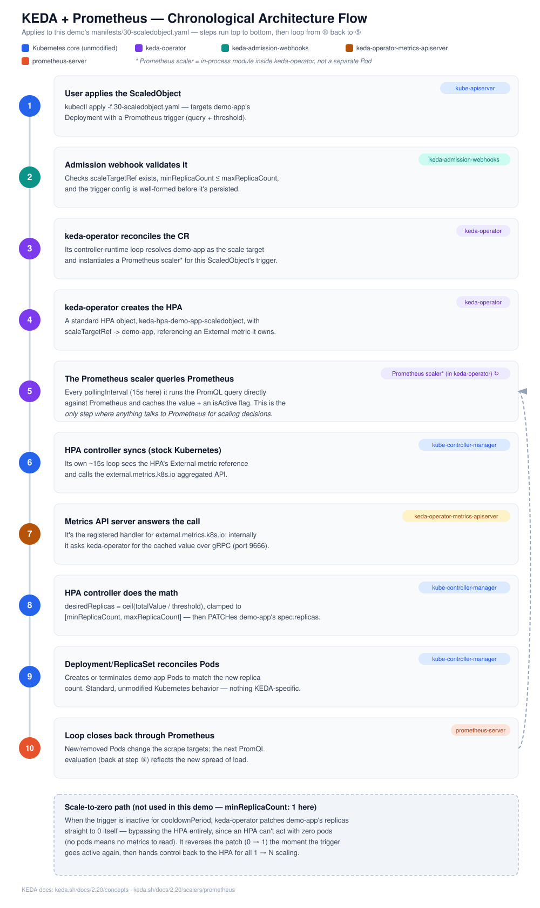

# Scaling Kubernetes Pods on Real Traffic with KEDA + Prometheus

End-to-end walkthrough for autoscaling a Kubernetes Deployment on a
**custom application metric** (`http_requests_total`, converted to a
`http_requests_per_second` rate) using **KEDA** instead of the Kubernetes
Metrics Server / Prometheus Adapter + HPA combo. Built for a
[Killercoda "Kubernetes Playground"](https://killercoda.com/playgrounds/scenario/kubernetes)
cluster, same as the [Prometheus Adapter version](../Prometheus-Adapter/Readme.md)
of this demo.

> ⚠️ **Note:** unlike the Adapter version of this demo, the command outputs
> shown below are **illustrative examples of what to expect**, not a
> captured transcript from a live run. The manifests and Helm values are
> correct against the KEDA/Prometheus docs referenced at the bottom, but
> walk through it once before relying on it for anything important.

**Install split:**
- **Prometheus** → Helm (`prometheus-community/prometheus`)
- **KEDA** → Helm (`kedacore/keda`)
- **Everything else** (demo app, ScaledObject, load generator) → raw `kubectl apply -f`

## Contents

- [Architecture](#architecture)
- [KEDA Operator Architecture (chronological)](#keda-operator-architecture-chronological)
- [Files](#files)
- [Why KEDA instead of the Prometheus Adapter?](#why-keda-instead-of-the-prometheus-adapter)
- [Understanding the key configuration](#understanding-the-key-configuration)
- [0. Prerequisites (Killercoda)](#0-prerequisites-killercoda)
- [1. Namespaces + Helm repos](#1-namespaces--helm-repos)
- [2. Deploy the demo app](#2-deploy-the-demo-app-raw-kubectl-apply)
- [3. Install Prometheus via Helm](#3-install-prometheus-via-helm)
- [4. Install KEDA via Helm](#4-install-keda-via-helm)
- [5. Deploy the ScaledObject](#5-deploy-the-scaledobject-raw-kubectl-apply)
- [6. Trigger a scale-out with the load generator](#6-trigger-a-scale-out-with-the-load-generator-raw-kubectl-apply)
- [What you should observe](#what-you-should-observe)
- [7. Cleanup](#7-cleanup)
- [Troubleshooting](#troubleshooting)
- [References](#references)

## Architecture


Same rationale as the Adapter demo for using a *rate*, not the raw counter:
`http_requests_total` only ever goes up, so scaling on it directly would
scale up forever and never down. The PromQL in the ScaledObject's trigger
rewrites it into `rate(...)`, which behaves like a normal load signal.

The key structural difference: there's no `custom.metrics.k8s.io` aggregated
API, no adapter rule config, and no manual RBAC (`auth-delegator`,
`auth-reader`, `custom-metrics-server-resources`) to wire up. KEDA's
operator polls Prometheus **directly** (it's the "external scaler"), and
its own metrics server exposes `external.metrics.k8s.io` for the HPA it
creates on your behalf. See [Why KEDA instead of the Prometheus Adapter?](#why-keda-instead-of-the-prometheus-adapter).

## KEDA Operator Architecture (chronological)

KEDA isn't one process — the Helm chart installs **three** components plus
a set of CRDs, and a stock, unmodified piece of core Kubernetes (the HPA
controller inside `kube-controller-manager`) still does the actual
scaling. Here's what each one owns:

| Component | Runs as | Job |
|---|---|---|
| `keda-operator` | Deployment, `keda` ns | Watches `ScaledObject`/`ScaledJob` CRs, resolves scale targets, runs every scaler (Prometheus, Kafka, ...), creates/owns the HPA for each ScaledObject, and directly patches replicas for the 0↔1 scale-to-zero transition (an HPA can't act with zero pods). |
| `keda-operator-metrics-apiserver` | Deployment, `keda` ns | Registers and serves the `external.metrics.k8s.io` aggregated API. Doesn't compute values itself — forwards each request to `keda-operator` over an internal **gRPC** call (port `9666`) and returns whatever it gets back. |
| `keda-admission-webhooks` | Deployment, `keda` ns | Validates `ScaledObject`/`ScaledJob` CRs at `kubectl apply` time (e.g. `scaleTargetRef` exists, `minReplicaCount ≤ maxReplicaCount`) so broken config fails fast instead of silently never scaling. |
| `ScaledObject` / `ScaledJob` CRDs | Custom Resource | What you author (`manifests/30-scaledobject.yaml`). Declares the target workload, replica bounds, and one or more triggers (here: `type: prometheus`). |
| `TriggerAuthentication` / `ClusterTriggerAuthentication` CRDs | Custom Resource | Where scaler credentials live (API keys, DB connection strings, etc). Not used in this demo — our Prometheus endpoint is unauthenticated. |
| HPA controller | Inside `kube-controller-manager`, untouched | The actual thing that changes `spec.replicas` for `1 → N` scaling. KEDA never replaces it — it just feeds it a metric through the external metrics API, the same way the Prometheus Adapter demo fed it through the custom metrics API. |

**Chronological flow for this demo** (steps ⑤–⑩ repeat forever on their
respective intervals once the ScaledObject is live):



1. **User applies the ScaledObject** — `kubectl apply -f manifests/30-scaledobject.yaml`.
2. **`keda-admission-webhooks` validates it** at admission time.
3. **`keda-operator` reconciles the CR** — resolves `demo-app` as the scale target and initializes the Prometheus scaler from `serverAddress`/`query`/`threshold`.
4. **`keda-operator` creates the HPA** — `keda-hpa-demo-app-scaledobject`, `scaleTargetRef -> demo-app`, referencing an External metric it owns.
5. **`keda-operator` starts polling Prometheus** every `pollingInterval` (15s here), caching the latest PromQL result and an `isActive` flag.
6. **The stock HPA controller syncs** on its own ~15s cycle, sees the External metric reference, and calls `external.metrics.k8s.io`.
7. **`keda-operator-metrics-apiserver` answers** by asking `keda-operator` for the cached value over the internal gRPC call.
8. **The HPA controller does the math** — `desiredReplicas = ceil(totalValue / threshold)`, clamped to `[minReplicaCount, maxReplicaCount]` — and PATCHes `demo-app`'s `spec.replicas`.
9. **The Deployment/ReplicaSet controller reconciles Pods** to match — nothing KEDA-specific, this is core Kubernetes.
10. **The loop closes through Prometheus** — new/removed pods change the scrape targets, so the next PromQL evaluation (back at step ⑤) reflects the new spread of load.

**Scale-to-zero, for context (not used in this demo — `minReplicaCount: 1`):**
when the trigger is inactive for `cooldownPeriod`, `keda-operator` patches
`demo-app`'s replicas straight to `0` itself, bypassing the HPA entirely —
an HPA can't act with zero pods since there'd be no metrics to read. The
moment the trigger goes active again, `keda-operator` patches `1` back in,
then hands control back to the HPA for all `1 → N` scaling. This is the
capability the Adapter+HPA demo structurally cannot offer (see the
[comparison table](#why-keda-instead-of-the-prometheus-adapter) below).

## Files

```
docs/
  keda-architecture.svg   chronological KEDA + Prometheus architecture diagram (see above)
helm/
  prometheus-values.yaml  Helm values for the Prometheus chart (adds the demo-app scrape job)
  keda-values.yaml        Helm values for the KEDA chart (trims resource requests/limits)
manifests/
  00-namespaces.yaml        demo + monitoring namespaces (keda namespace comes from --create-namespace)
  01-demo-app-configmap.yaml dummy app source (stdlib-only Python, no image build needed)
  02-demo-app-deployment.yaml Deployment + Service for the demo app
  30-scaledobject.yaml       ScaledObject targeting http_requests_total via a Prometheus trigger
  31-load-generator.yaml     busybox pod hammering demo-app to trigger a scale-out
```

No Dockerfile and no image registry needed — the "app" is the same small
stdlib-only Python HTTP server from the Adapter demo, injected via a
`ConfigMap` and run with the public `python:3.12-alpine` image.

## Why KEDA instead of the Prometheus Adapter?

| | Prometheus Adapter + HPA | KEDA |
|---|---|---|
| Metric path | Prometheus → Adapter → `custom.metrics.k8s.io` → HPA | Prometheus → KEDA operator → HPA it creates for you |
| RBAC/API wiring | Manual: `APIService`, `auth-delegator`, `auth-reader`, `custom-metrics-server-resources` ClusterRoleBinding | Chart-managed; nothing to hand-wire |
| Config object | Adapter's `rules.custom` block (Helm values, cluster-wide) | `ScaledObject` CRD (per-workload, namespaced) |
| Scale to zero | Not possible — HPA has a hard `minReplicas: 1` floor | Supported (`minReplicaCount: 0` + `idleReplicaCount`) — not used in this demo to keep it directly comparable |
| Other event sources | Prometheus only | 60+ scalers (Kafka, SQS, RabbitMQ, cron, Redis, ...) behind the same CRD |
| Rule scope | One rule config governs every metric of that shape, cluster-wide | One ScaledObject per workload — easier to reason about, easier to blast-radius-limit |

Both ultimately drive a standard Kubernetes `HorizontalPodAutoscaler` — KEDA
just creates and owns that HPA object for you (named
`keda-hpa-<scaledobject-name>`) instead of you writing one by hand.

---

## Understanding the key configuration

Four pieces of config are doing all the real work here — three of them
(app metrics, scrape relabeling, HPA scaling math) are unchanged from the
Adapter demo.

### 1. The app hand-writes its own metrics — no client library

```
# TYPE http_requests_total counter
http_requests_total{method="GET",path="/work"} 2
```

Same as before: plain text, `# TYPE counter` marks it monotonic (`rate()`
depends on that).

### 2. Scrape relabeling — the #1 silent-failure point

```yaml
kubernetes_sd_configs:
- role: pod
relabel_configs:
- source_labels: [__meta_kubernetes_pod_annotation_prometheus_io_scrape]
  action: keep
  regex: true
```

| Rule | Why |
|---|---|
| `role: pod` | Discovers **every** pod in the cluster as a candidate |
| `keep` on the annotation | Narrows it to pods with `prometheus.io/scrape: "true"` |
| rebuild `__address__` / `__metrics_path__` | Reads the actual port/path from `prometheus.io/port` and `/path` |
| `labelmap` | Copies pod labels onto the stored series |
| promote `namespace` / `pod` | Turns `__meta_kubernetes_namespace/pod_name` into plain labels used by the ScaledObject's PromQL filter |

### 3. The ScaledObject — one CRD, no separate rule config

```yaml
spec:
  scaleTargetRef:
    name: demo-app
  minReplicaCount: 1
  maxReplicaCount: 5
  pollingInterval: 15
  cooldownPeriod: 60
  triggers:
  - type: prometheus
    metadata:
      serverAddress: http://prometheus-server.monitoring.svc.cluster.local
      query: sum(rate(http_requests_total{namespace="demo"}[2m]))
      threshold: "5"
```

| Field | Job |
|---|---|
| `scaleTargetRef` | Which Deployment KEDA should scale — same idea as the HPA's `scaleTargetRef` |
| `pollingInterval` | How often (seconds) the KEDA operator re-runs the query against Prometheus. Independent of Prometheus's own 15s scrape interval. |
| `cooldownPeriod` | How long to wait, once the trigger goes inactive, before scaling back to `minReplicaCount`. Matters most for scale-to-zero; kept here for parity with the Adapter demo's HPA cooldown behavior. |
| `query` | Live PromQL. **No `by (pod)`** needed — unlike the Adapter's per-pod query, KEDA's default `metricType: AverageValue` divides the *total* value by the current replica count itself. |
| `threshold` | Same role as the Adapter demo's `averageValue: "5"` — target requests/sec per replica. |

### 4. No aggregated API RBAC to hand-wire

The Adapter demo needed three separate RBAC concerns wired up manually
(TLS trust, `auth-delegator`/`auth-reader` for authN, a ClusterRoleBinding
for authZ) because the Adapter *is* the `custom.metrics.k8s.io` API server.
KEDA's chart creates and owns its own `external.metrics.k8s.io`
`APIService` and all matching RBAC — there's nothing equivalent to
hand-configure here. Verified in step 4 below.

### 5. HPA scaling math (via the HPA KEDA creates)

Identical formula to the Adapter demo, since KEDA's default `AverageValue`
metric type maps straight onto the same Kubernetes HPA semantics:

```
desiredReplicas = ceil(currentAverageValue / threshold)
```

3 pods together producing 30 req/s → `currentAverageValue` (the *total*,
before KEDA's HPA divides it) → desired replicas = `ceil(30 / 5)` = `6`,
capped at `maxReplicaCount: 5`. The `stabilizationWindowSeconds: 60` in
`advanced.horizontalPodAutoscalerConfig.behavior.scaleDown` avoids flapping
the same way it did in the raw HPA version.

### 6. Load generator: concurrency, not rate, drives throughput

Unchanged from the Adapter demo — 10 **sequential blocking** loops, so
achieved rate ≈ `10 ÷ avg latency`, not "10 req/s". More parallel loops =
more throughput.

---

## 0. Prerequisites (Killercoda)

1. Start the **Kubernetes Playground** scenario on Killercoda (or any
   scenario that gives you a working multi-node cluster with `kubectl`
   pre-configured).
2. Confirm the cluster is up and Helm is available:
   ```bash
   kubectl get nodes
   helm version
   ```
   If `helm` isn't installed:
   ```bash
   curl -fsSL -o get_helm.sh https://raw.githubusercontent.com/helm/helm/main/scripts/get-helm-3
   chmod +x get_helm.sh
   ./get_helm.sh
   ```
3. Get this repo's `helm/` and `manifests/` directories onto the playground
   terminal (clone it if you've pushed it to GitHub, or copy the files over
   another way).

> **Heads up:** as with the Adapter demo, `kubectl top nodes` will return
> `error: Metrics API not available` on this cluster — that needs a
> separate `metrics-server` component this demo doesn't install. Every
> metric here flows through `external.metrics.k8s.io`, served by KEDA's own
> metrics server (installed in step 4), a completely different API group.

Everything below assumes your shell's current directory is this repo's
root (the one containing `helm/`, `manifests/`, `Readme.md`).

---

## 1. Namespaces + Helm repos

```bash
kubectl apply -f manifests/00-namespaces.yaml

helm repo add prometheus-community https://prometheus-community.github.io/helm-charts
helm repo add kedacore https://kedacore.github.io/charts
helm repo update
```

Expected output:
```
namespace/demo created
namespace/monitoring created
"prometheus-community" has been added to your repositories
"kedacore" has been added to your repositories
Hang tight while we grab the latest from your chart repositories...
...Successfully got an update from the "prometheus-community" chart repository
...Successfully got an update from the "kedacore" chart repository
Update Complete. ⎈Happy Helming!⎈
```

The `keda` namespace isn't created here — `helm install --create-namespace`
in step 4 creates it for you.

---

## 2. Deploy the demo app (raw `kubectl apply`)

```bash
kubectl apply -f manifests/01-demo-app-configmap.yaml
kubectl apply -f manifests/02-demo-app-deployment.yaml
kubectl rollout status deployment/demo-app -n demo
```

**Verify the metric exists and increments** (identical to the Adapter demo):

```bash
kubectl run curl-test --rm -it --restart=Never --image=curlimages/curl -n demo \
  -- sh -c 'for i in $(seq 1 5); do curl -s http://demo-app-svc.demo.svc.cluster.local:8080/work; done; curl -s http://demo-app-svc.demo.svc.cluster.local:8080/metrics'
```

Expected output ends with:
```
# HELP http_requests_total Total number of HTTP requests handled by /work
# TYPE http_requests_total counter
http_requests_total{method="GET",path="/work"} 5
```

---

## 3. Install Prometheus via Helm

```bash
helm install prometheus prometheus-community/prometheus \
  -n monitoring \
  -f helm/prometheus-values.yaml

kubectl rollout status deployment/prometheus-server -n monitoring --timeout=180s
```

**Confirm the Service name/port** (the ScaledObject needs this to be right):

```bash
kubectl get svc -n monitoring
```

Expect `prometheus-server` on port `80` — matches
`manifests/30-scaledobject.yaml`'s `serverAddress`. If your resolved chart
version names it differently, update that field before step 5.

**Verify Prometheus is scraping the app** — same as the Adapter demo:

```bash
kubectl port-forward --address 0.0.0.0 -n monitoring svc/prometheus-server 9090:80
```

Open the Killercoda-exposed port `9090`, go to **Status → Targets**, and
confirm a `custom-pod-metrics` job with `demo-app`'s pod `UP`. Stop the
port-forward (`Ctrl+C`) once confirmed.

---

## 4. Install KEDA via Helm

```bash
helm install keda kedacore/keda \
  -n keda --create-namespace \
  -f helm/keda-values.yaml

kubectl rollout status deployment/keda-operator -n keda --timeout=180s
kubectl rollout status deployment/keda-operator-metrics-apiserver -n keda --timeout=180s
```

**Verify the CRDs and pods:**

```bash
kubectl get crd | grep keda.sh
kubectl get pods -n keda
```

Expected:
```
scaledjobs.keda.sh
scaledobjects.keda.sh
triggerauthentications.keda.sh
clustertriggerauthentications.keda.sh

NAME                                                  READY   STATUS    RESTARTS   AGE
keda-admission-webhooks-xxxxxxxxxx-xxxxx              1/1     Running   0          60s
keda-operator-xxxxxxxxxx-xxxxx                        1/1     Running   0          60s
keda-operator-metrics-apiserver-xxxxxxxxxx-xxxxx      1/1     Running   0          60s
```

**Verify the external metrics APIService is healthy** — this is the KEDA
equivalent of the Adapter demo's `v1beta1.custom.metrics.k8s.io` check:

```bash
kubectl get apiservice v1beta1.external.metrics.k8s.io
```

Expect `AVAILABLE: True`. Note there's no cert/RBAC step to verify
separately here — the chart handled all of that (see
[Understanding the key configuration, §4](#4-no-aggregated-api-rbac-to-hand-wire)).

---

## 5. Deploy the ScaledObject (raw `kubectl apply`)

```bash
kubectl apply -f manifests/30-scaledobject.yaml
kubectl get scaledobject -n demo
```

Expected:
```
NAME                     SCALETARGETKIND      SCALETARGETNAME   MIN   MAX   TRIGGERS     READY   ACTIVE   AGE
demo-app-scaledobject    apps/v1.Deployment    demo-app          1     5     prometheus   True    False    10s
```

`READY: True` means KEDA accepted the config and set up the trigger.
`ACTIVE: False` just means there's no load yet.

**Confirm KEDA created the underlying HPA:**

```bash
kubectl get hpa -n demo
```

Expected:
```
NAME                                    REFERENCE             TARGETS   MINPODS   MAXPODS   REPLICAS   AGE
keda-hpa-demo-app-scaledobject          Deployment/demo-app   0/5       1         5         1          15s
```

Give it a poll cycle (`pollingInterval: 15`) and then:

```bash
kubectl describe scaledobject demo-app-scaledobject -n demo
```

Look for `Condition Ready: True` and `Condition ScalingActive` — the
`ScalingActive` reason confirms KEDA is successfully querying Prometheus.

If it stays `False`/`Unknown` for more than ~2 minutes, see
[Troubleshooting](#troubleshooting).

---

## 6. Trigger a scale-out with the load generator (raw `kubectl apply`)

In one terminal, watch the HPA KEDA created:

```bash
kubectl get hpa -n demo -w
```

In another terminal, watch the pods:

```bash
kubectl get pods -n demo -w
```

In a third terminal, start the load generator (10 parallel tight loops
hitting `/work`, comfortably over the `5 req/s per pod` threshold):

```bash
kubectl apply -f manifests/31-load-generator.yaml
```

**Trigger scale-down:** delete the load generator and wait — the
`stabilizationWindowSeconds: 60` in the ScaledObject's
`advanced.horizontalPodAutoscalerConfig.behavior.scaleDown` means the HPA
waits ~60s of low load before scaling back down:

```bash
kubectl delete -f manifests/31-load-generator.yaml
kubectl get hpa -n demo -w
```

---

## What you should observe

Over 1-3 minutes after starting the load generator, expect the same shape
of behavior as the Adapter demo's real transcript (see that repo's
[Proof: watch it actually scale](../Prometheus-Adapter/Readme.md#proof-watch-it-actually-scale)
section for an actual captured run of the equivalent scenario):

1. `kubectl get hpa -n demo -w` shows `TARGETS` climbing well past `5`.
2. `demo-app`'s replica count follows, `Pending` → `Running`, up to
   `maxReplicaCount: 5`.
3. After deleting the load generator, the metric decays over ~2 minutes
   (`rate(...[2m])` is a rolling window), and replicas hold at `5` for
   ~60s past that (the `stabilizationWindowSeconds: 60`) before stepping
   back down to `minReplicaCount: 1`.

The mechanics — rolling-window decay, stabilization-window-driven
scale-down delay — are identical to the Adapter demo, since both ultimately
ride on the same underlying `HorizontalPodAutoscaler` controller loop.

---

## 7. Cleanup

```bash
kubectl delete -f manifests/31-load-generator.yaml --ignore-not-found
kubectl delete -f manifests/30-scaledobject.yaml --ignore-not-found

helm uninstall keda -n keda
helm uninstall prometheus -n monitoring

kubectl delete -f manifests/02-demo-app-deployment.yaml --ignore-not-found
kubectl delete -f manifests/01-demo-app-configmap.yaml --ignore-not-found

kubectl delete namespace demo monitoring keda
```

---

## Troubleshooting

**Killercoda's Traffic Port Accessor shows `502 Bad Gateway`**
- Your `kubectl port-forward` is bound to `127.0.0.1` instead of `0.0.0.0`.
  Rerun with `--address 0.0.0.0`, e.g.
  `kubectl port-forward --address 0.0.0.0 -n monitoring svc/prometheus-server 9090:80`.

**`helm install` fails on an unrecognized key in `prometheus-values.yaml`**
- Chart versions occasionally rename subchart toggle keys. Run
  `helm show values prometheus-community/prometheus` to see current key
  names and adjust the values file.

**`kubectl get scaledobject` shows `READY: False` or `Unknown`**
- `kubectl describe scaledobject demo-app-scaledobject -n demo` — read the
  `Events` and `Conditions` blocks, they usually name the exact failure
  (e.g. can't reach `serverAddress`).
- `kubectl logs -n keda deploy/keda-operator` — look for errors reaching
  Prometheus or parsing the trigger query.
- Confirm `serverAddress` in `manifests/30-scaledobject.yaml` actually
  matches `kubectl get svc -n monitoring` (see step 3).

**`kubectl get apiservice v1beta1.external.metrics.k8s.io` shows `AVAILABLE: False`**
- `kubectl describe apiservice v1beta1.external.metrics.k8s.io` for the
  status message.
- `kubectl logs -n keda deploy/keda-operator-metrics-apiserver`.
- Confirm `kubectl rollout status deployment/keda-operator-metrics-apiserver -n keda`
  finished successfully.

**HPA shows `<unknown>` in `kubectl describe hpa -n demo`**
- Read the `Events` — same failure modes as the ScaledObject not-ready
  case above, since this HPA is entirely KEDA-managed.
- Confirm the series exists in Prometheus first:
  `curl 'http://localhost:9090/api/v1/query?query=http_requests_total'`
  via the port-forward from step 3. If empty, check **Status → Targets**
  in Prometheus for the `custom-pod-metrics` job and confirm `demo-app`'s
  pod carries `prometheus.io/scrape: "true"`
  (`kubectl get pod -n demo -o yaml | grep prometheus.io`).

**Load generator doesn't move the numbers**
- Confirm it's running cleanly: `kubectl logs -n demo deploy/load-generator`
  (should be silent — `wget -q` suppresses output on success).
- Confirm DNS resolves inside the cluster:
  `kubectl exec -n demo deploy/load-generator -- nslookup demo-app-svc.demo.svc.cluster.local`.
- Bump the loop count in `manifests/31-load-generator.yaml` (`seq 1 10` →
  higher) if 10 parallel loops aren't enough to clear the `5 req/s`
  threshold on your cluster's network latency.

**`prometheus-server` pod stuck `Pending`**
- Almost always a PVC waiting on a StorageClass that doesn't exist.
  Confirm `server.persistentVolume.enabled: false` is applied:
  `kubectl get pvc -n monitoring` should show nothing.

---

## References

- [KEDA — Deploying KEDA](https://keda.sh/docs/2.20/deploy/)
- [KEDA — Prometheus scaler](https://keda.sh/docs/2.20/scalers/prometheus/)
- [KEDA — ScaledObject specification](https://keda.sh/docs/2.20/reference/scaledobject-spec/)
- [KEDA — Scaling Deployments, StatefulSets & Custom Resources](https://keda.sh/docs/2.20/concepts/scaling-deployments/)
- [kedacore/charts on GitHub](https://github.com/kedacore/charts)
